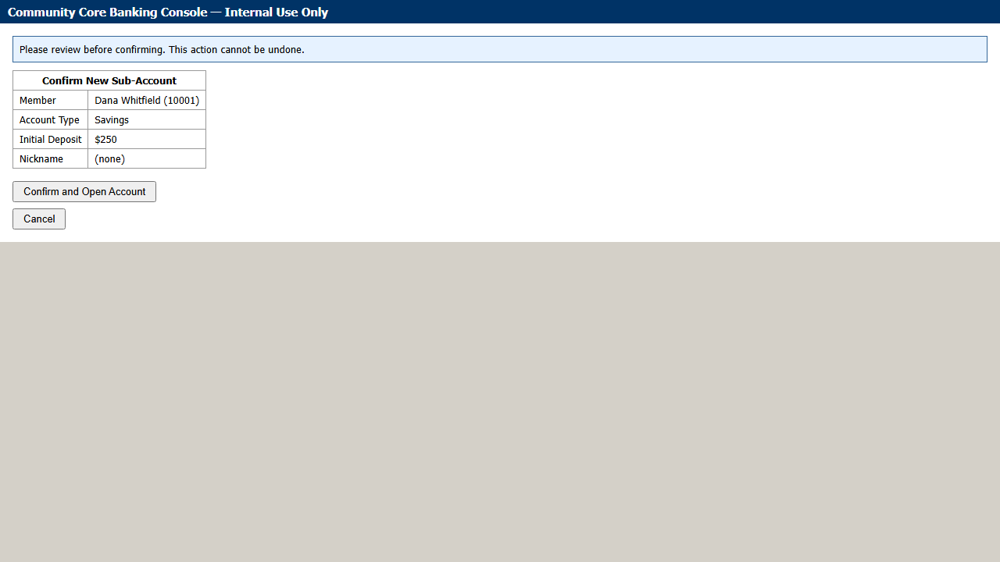
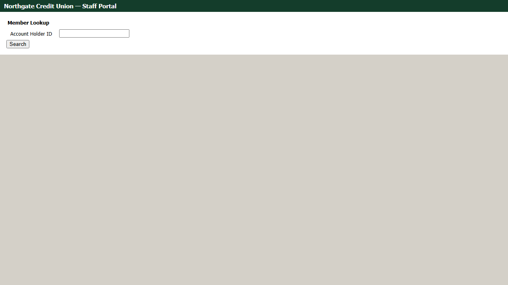
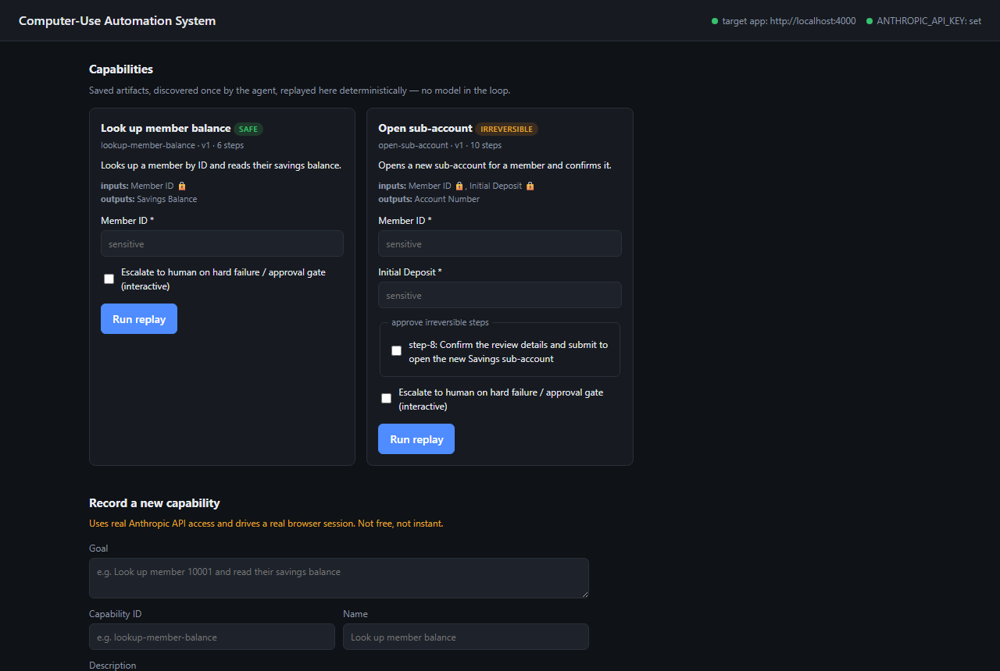

# Computer-Use Automation System

A discover-once / replay-many automation layer for back-office UIs that have no API: an LLM
figures out how to complete a task in a real browser session, the successful run is recorded as a
typed, versioned **capability artifact**, and that artifact replays deterministically afterward
with no model in the loop. Built for interface.ai's take-home brief — see
`Assignment — Computer-Use Automation System.pdf` and **[REPORT.md](./REPORT.md)** for the design
write-up.

The target application is a small "legacy core banking console" included in this repo
(`src/target-app`) — table-layout, no test IDs, server-rendered — built specifically to exercise
the brief's "no clean DOM" reality without touching a real bank or a public site's ToS.

## Screenshots

Real output from real runs — see `/evidence` for the full logs behind these, and
[REPORT.md](./REPORT.md#screenshots) for the same set with more context.

| | |
|---|---|
|  |  |
| A real discovery run reaching the member detail page, about to read the balance. | Replay paused before an irreversible step, waiting for human approval. |
|  |  |
| The base artifact replayed against a second tenant: the one incompatible field fails identifiably, not silently. | The local dashboard (`npm run ui`) — capability catalog with generated replay forms. |

## Prerequisites

- Node.js 20+
- An Anthropic API key, **only** if you want to run the discovery agent yourself (replay and the
  automated tests need no API key or network access beyond localhost).

## Setup

```bash
npm install
npx playwright install chromium
cp .env.example .env
# edit .env and set ANTHROPIC_API_KEY if you want to run discovery
```

## Running without live services

The replay engine, locator resolution, checkpoint verification, the allowlist, and the full
business-outcome / recoverable / hard-failure error taxonomy are covered by an automated test that
needs no LLM and no API key — it starts the mock target app itself and replays hand-authored
artifacts against it:

```bash
npm run test:replay
```

This is the fast, LLM-free safety net for the replay engine. The canonical artifacts used for
`/evidence`, below, come from a real discovery run, as the brief requires.

## Visual dashboard

The fastest way to see the system actually working, rather than reading JSON output. A local
Express + vanilla-JS dashboard (`src/ui`) — not a hosted page, since it drives a real Playwright
browser and reads the real filesystem, neither of which a sandboxed static page can do:

```bash
npm run target-app   # in one terminal
npm run ui            # in another -> http://localhost:4100
```

Open `http://localhost:4100`. From there you can:

- **See every saved capability** — its schema, inputs/outputs, and which steps are irreversible.
- **Trigger a replay** from a generated form (typed per the artifact's own `inputs`) and watch it
  run: live step-by-step log, screenshots, and the final result (success / business outcome /
  blocked-pending-approval / failure) — try different member IDs (`10001`, `55555` for not-found,
  `99999` for the session-timeout recovery, `77777` for permission-denied) to see the taxonomy from
  `REPORT.md` §3 for real.
- **Record a new capability** from a goal, if `ANTHROPIC_API_KEY` is set (this costs real API
  calls and drives a real browser session — the dashboard says so before you click it).
- **Resume an escalated run from a button.** When a run pauses for human intervention (an
  irreversible step awaiting approval, or a hard failure with `interactive` set), the dashboard
  shows the reason, the screenshot at the moment it paused, and a **Resume** button that actually
  hands control back — not a mock. `escalation/handoff.ts` races two independent resume signals (a
  terminal keypress, the original mechanism, and an external flip of `control-state.json`'s
  `owner` field, which is what this button does); either one is a legitimate "a human is done."

## Demo path

**1. Start the target app** (leave running in its own terminal):

```bash
npm run target-app
# -> http://localhost:4000, seed member IDs: 10001, 10002, 77777, 88888, 99999
```

**2. Run the discovery agent** on a goal (requires `ANTHROPIC_API_KEY` in `.env`):

```bash
npm run agent -- \
  --goal "Look up member 10001 and read their savings balance" \
  --capability-id lookup-member-balance \
  --name "Look up member balance" \
  --description "Looks up a member by ID and reads their savings balance."
```

This drives a real, visible-if-`HEADED=1` Chromium session, logs every observe/decide/act step to
`evidence/discovery-lookup-member-balance-<timestamp>/`, and on success saves a versioned artifact
to `artifacts/lookup-member-balance.v1.json`.

**3. Replay the recorded artifact**, without touching the LLM. `--param name=value` (repeatable) is
the params interface to use — it needs no JSON shell-quoting, which matters concretely on Windows:
npm's script runner mangles a quoted JSON blob passed through `npm run ... --` (confirmed while
producing this repo's own `/evidence`), even though quoting works fine calling `node
dist/cli/replay.js` directly. `--params '<json>'` is kept as a POSIX-shell shorthand.

```bash
npm run replay -- --capability-id lookup-member-balance --param memberId=10001
# -> {"status":"success","outputs":{"savingsBalance":"$2,450.00"}}

npm run replay -- --capability-id lookup-member-balance --param memberId=10002
# -> a *different* member than discovery ever saw -- confirms the artifact generalized, not just replayed literally
# -> {"status":"success","outputs":{"savingsBalance":"$12,045.00"}}
```

**4. Replay against exceptional inputs**, to see the business-outcome/recoverable paths:

```bash
npm run replay -- --capability-id lookup-member-balance --param memberId=55555
# -> {"status":"business_outcome","outcomeName":"member_not_found", ...}

npm run replay -- --capability-id lookup-member-balance --param memberId=99999
# -> triggers a simulated one-time session timeout; replay detects it, re-authenticates
#    by replaying this capability's own login steps, and resumes -- {"status":"success", ...}
```

**5. Record and replay the irreversible capability** (opening a sub-account requires an explicit
approval per step, per the safety model in `REPORT.md` section 6):

```bash
npm run agent -- \
  --goal "Open a new Savings sub-account for member 10001 with a 250 dollar initial deposit and reach the confirmation screen" \
  --capability-id open-sub-account \
  --name "Open sub-account" \
  --description "Opens a new sub-account for a member and confirms it."

# Without --approve, replay stops before the irreversible step (the exact step ID is in the artifact / this result):
npm run replay -- --capability-id open-sub-account --param memberId=10001 --param initialDeposit=250
# -> {"status":"blocked_pending_approval","stepId":"step-8", ...}

# With explicit approval:
npm run replay -- --capability-id open-sub-account --param memberId=10002 --param initialDeposit=300 --approve step-8
# -> {"status":"success","outputs":{"accountNumber":"500006"}}

# Exceptional inputs work here too:
npm run replay -- --capability-id open-sub-account --param memberId=10001 --param initialDeposit=0 --approve step-8
# -> {"status":"business_outcome","outcomeName":"validation_error", ...}   (app-level rule, not just type validation)
npm run replay -- --capability-id open-sub-account --param memberId=77777 --param initialDeposit=250 --approve step-8
# -> {"status":"business_outcome","outcomeName":"permission_denied", ...}  (member 77777 is restricted)
```

**6. Human-in-the-loop escalation.** Discovery escalates automatically (`--escalate` defaults to
on) when the model gives up, hits repeated action failures, or would leave the allowlisted origin;
replay escalates when passed `--interactive`, on any hard failure or approval gate:

```bash
npm run agent -- \
  --goal "Open a new sub-account for member 42 with a 100 dollar deposit" \
  --capability-id open-subaccount-escalation-demo \
  --name "Open sub-account (escalation demo)" \
  --description "Demonstrates escalation when the target member does not exist."
# member 42 doesn't exist -> the model correctly gives up rather than guessing -> automation pauses,
# writes an intervention request (evidence/discovery-open-subaccount-escalation-demo-<ts>/control-state.json),
# and prints the reason/context. Press Enter in the terminal to hand control back.

npm run replay -- --capability-id open-sub-account --param memberId=77777 --param initialDeposit=250 --approve step-8 --interactive
```

When an intervention is requested, the automation prints the reason/context to the terminal and
the live browser window (run with `HEADED=1`) is the actual automation session — interact with it
directly, then press Enter in the terminal to hand control back. A minimal, read-only "operator
console" can inspect the same intervention record from another terminal:

```bash
npm run operator -- --run evidence/<run-directory>
```

**7. Agent-facing capability interface (MCP).** Every saved artifact is also exposed as an MCP tool
— discoverable and callable by name with typed args by any MCP-speaking agent, not just this repo's
CLI. Start the target app first, then:

```bash
npm run mcp-demo
```

This spawns `npm run mcp-server` (an MCP stdio server built from `src/mcp/server.ts`) as a real
subprocess, connects a real MCP client, lists the discovered tools, and calls both capabilities
across the happy path, a business outcome, the approval gate, and the approved path. To point an
MCP-capable host (Claude Code, Claude Desktop, etc.) at it directly instead, configure it to run
`node dist/cli/mcpServer.js` from this directory (after `npm run build`).

**8. Cross-tenant reuse.** The `lookup-member-balance` artifact, recorded once against the base
target app, replayed against a second, independently-branded instance of the same vendor product
(`src/target-app/tenantB`) with different data and one deliberately hostile difference (an
unlabeled search field):

```bash
npm run cross-tenant-demo
```

This starts both target apps itself. It first replays the artifact **unmodified** against tenant B
— login and balance extraction work with no changes, the search step fails identifiably at exactly
the one incompatible field — then applies a single targeted `TenantOverride` for that one step and
replays again, extracting tenant B's own data. See `REPORT.md` section 4 for what this actually
found (a real bug, not just a successful demo).

## Environment variables

See `.env.example`. `ANTHROPIC_API_KEY`/`AGENT_MODEL` are only needed for `npm run agent`.
`TARGET_BASE_URL`/`TARGET_APP_PORT` point everything at the mock target app. `HEADED=1` runs a
visible browser window (required to actually perform the human-handoff demo yourself).

## Repository layout

```
src/
  target-app/     mock "legacy core banking console" target application (Express, table layout, no test IDs)
                  tenantB/  a second, independently-branded instance of the same vendor product (cross-tenant reuse demo)
  artifact/       capability artifact schema (zod), versioned on-disk store, tenantOverride.ts (per-variant override patching)
  agent/          discovery loop: perception (set-of-marks), LLM client/tools, action execution, recorder
  replay/         deterministic replay engine: locator resolution, checkpoints, error taxonomy
  safety/         allowlist, risk classification, redaction
  escalation/      control-state + human handoff over the live session
  evidence/       structured JSONL logging + screenshots
  mcp/            agent-facing capability interface: one MCP tool per saved artifact (stretch goal)
  ui/             local verification dashboard (Express + vanilla JS) -- server.ts, runsRegistry.ts, public/
  cli/            run.ts (discovery), replay.ts, operator.ts (mocked operator console), mcpServer.ts
  test/           smoke-test.ts (LLM-free replay regression), mcpClientDemo.ts (real MCP client), crossTenantDemo.ts
artifacts/        saved capability artifacts (JSON), versioned per capability id
evidence/         per-run structured logs + screenshots (discovery and replay)
REPORT.md         design write-up
```
