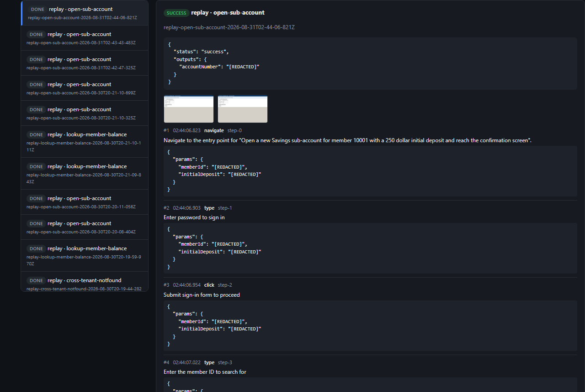

# REPORT

## Screenshots

Real output, not mockups — from the discovery/replay runs described below and in `/evidence`.

| | |
|---|---|
|  |  |
| Discovery run (section 1/3): the agent reaches the member detail page and is about to read the balance. | Escalation (section 5): replay pauses before the irreversible confirm step, waiting for approval. |
|  |  |
| Cross-tenant reuse (section 4): the one field with no accessible name fails identifiably on tenant B, not silently. | Local dashboard (`npm run ui`, section 1): capability catalog with generated replay forms. |

 Dashboard run detail for the escalation run on the left: the `success` result with a redacted output, and the structured log with redacted params for every step.

## 1. Architecture

Node/TypeScript + Playwright (Chromium) + the Anthropic Messages API. Discovery and replay share
two abstractions — a **capability artifact** and a **locator** — so they never diverge on "how do
we find and act on the page," only on who decides what to do.

- **`target-app/`** — a mock "legacy core banking console" (Express, table-layout, no test IDs) I
  built as the proxy target, so the discovery run could be genuine while error conditions (permission
  denial, session timeout, validation errors) and an irreversible action stayed under my control.
- **`agent/`** — the discovery loop. `perception.ts` turns the live DOM into a numbered
  "set-of-marks": every interactive control and table cell gets a ref, a role/accessible-name, and
  a CSS fallback, shown as an annotated screenshot plus a text list. `llmClient.ts` gives the model
  a small closed tool set (`click`, `type`, `select`, `extract`, `wait`, `finish`, `give_up`) that
  only ever operates on those refs — never raw coordinates, never free-form selectors. `recorder.ts`
  is pure, deterministic code that turns the executed trace into a `CapabilityArtifact`.
- **`artifact/`** — the schema (zod) and a versioned file store (`artifacts/<id>.v<N>.json`).
- **`replay/`** — the deterministic executor: locator resolution with a fallback chain, checkpoint
  verification, and the error taxonomy (business outcome / recoverable / hard failure).
- **`safety/`** and **`escalation/`** — allowlist/risk/redaction and human-handoff, shared by both.

**Trade-off: single process, synchronous, no queues.** A discovery or replay run is "drive one
Playwright page to completion and report a result" — there's no concurrency problem at this scale,
and a queue here would be ceremony. `replayArtifact(artifact, params, { page, ... })` is already a
clean function boundary; scaling it later is "run N of these," not a redesign.

**Trade-off: the model only acts through numbered refs, never coordinates.** Raw
screenshot-and-coordinate control is more general but produces actions that are hard to turn into a
*stable* locator afterward — a coordinate is a fact about one screenshot, not the page. Grounding
the model in the same role/name/CSS candidates the recorder uses means the model's decision and the
artifact's locator come from the same data in the same step.

**Not required, included anyway: a local verification dashboard** (`src/ui`, `npm run ui`). It's a
third caller of the same `replayArtifact`/`runDiscovery` functions the CLI and MCP server use, not
a fourth execution path, and it made real bugs (section 3) easier to see than raw JSON did. Its one
new piece of logic: `escalation/handoff.ts`'s `pauseForHuman` now races a terminal keypress against
an external flip of `control-state.json`, so the dashboard's Resume button is a second real way to
hand control back, not a mock layered on the terminal one.

## 2. Artifact schema

A capability artifact is a contract, not a step list: `{ inputs, outputs, steps, successCheckpoint,
errorHandlers, risk, provenance }` (`src/artifact/schema.ts`).

- **Every locator is a fallback chain**: `{ primary, fallbacks: [] }`, each entry `role+name`
  (preferred — survives markup churn, has a desktop analogue), `text`, `label`, or `css` (last
  resort, flagged `fragile: true`). Replay takes the first strategy that resolves to one visible
  element. This is the single biggest lever for "stable UI, but not identical every time."
- **Steps reference input params by name, never literal value.** The `type`/`select` tool calls
  require the model to declare, per value, whether it's parameter-worthy (`isParameter`,
  `paramName`, `paramType`, `sensitive`) — the model has the context to know "12345" is a member ID
  and "Vacation Fund" is incidental. Same pattern for `extract` and for `finish.successCheckpointText`
  (an exact visible string the model asserts proves success). The recorder never calls the model
  again; it's a faithful transcription of judgment calls the model already made.
- **Risk is per-step, not per-capability.** `risk: "safe" | "irreversible"` comes from a
  pattern-based classifier (button text, URL shape) biased toward false positives. Any irreversible
  step sets `requiresConfirmation: true`, enforced by the replay engine regardless of caller intent.
- **Error handlers travel with the artifact but are authored once per target app**, not per
  capability (`target-app/errorHandlers.ts`) — see section 4.

## 3. Determinism & error handling

Replay never asks a model anything. Determinism rests on three things: the same locator-resolution
algorithm discovery used to ground the model, an explicit checkpoint after every state-changing
step, and a closed error taxonomy instead of ad hoc retries.

**Checkpoints** are `urlMatches` (pathname regex — origin is the allowlist's job), `textVisible` /
`textNotVisible`, or `elementVisible`. The recorder infers `urlMatches` automatically on a URL
change; the model supplies `successCheckpoint` explicitly at `finish`.

**The taxonomy** (`replay/errorTaxonomy.ts`): when a checkpoint fails (or a locator can't resolve
at all — both converge on the same handler-matching code), the engine checks the artifact's
`errorHandlers` in order:

- **`business_outcome`** — a legitimate answer, not a crash ("no such member," "permission
  denied"). Returns `{ status: "business_outcome", outcomeName, outputs }`, a distinct shape from
  both success and failure.
- **`recoverable`** — `dismissAndContinue` or `reauthenticate`. Re-authentication holds no separate
  credentials: a session loss invalidates whatever state earlier steps built, so recovery replays
  the capability's *own* earlier steps from the top (including whatever login the discovery run
  itself needed), then retries. My first version instead saved/restored a single "return URL,"
  which broke the moment the timeout page redirected somewhere other than expected.
- **Unhandled → hard failure.** `{ status: "failure", stepId, expected, observed, message }`, and —
  if wired up — a live human gets a chance to resolve it on the same session before giving up
  (section 5).

`src/test/smoke-test.ts` exercises all of this against the real mock app (happy path, not-found, a
simulated session timeout with recovery, missing-parameter validation, the approval gate, a
validation error, the irreversible happy path) with no LLM — regression-tested, not just described.
UI drift is handled by the same fallback chain: `role+name` survives most markup/CSS changes; if it
stops resolving, replay falls to `text`, then the fragile `css` path, and only then hard-fails.

**What the real discovery run actually broke.** The smoke test above passed before I ever ran a
real discovery, using hand-authored artifacts shaped like what discovery *should* produce. A real
run against `claude-sonnet-5` immediately found three bugs the synthetic test couldn't, because it
never exercised the model's actual (reasonable, but different-than-mine) choices:

1. **Checkpoint matching used the wrong text view.** `textVisible` matched Playwright's `getByText`
   against per-element `textContent`, but the model's checkpoint text was lifted from rendered
   `innerText`, which inserts a tab between adjacent table cells with *no* text node between them in
   the DOM — the checkpoint could never match. Fixed by matching against the same `innerText`-based
   view the model is shown.
2. **Locator ambiguity picked the wrong element.** On multiple matches, `.first()` assumed sibling
   duplicates (fine for two "Back to Search" links); but the model's table-cell extract locator also
   matched every text-containing *ancestor* of that cell, and `.first()` in document order is the
   outermost one — a balance extraction returned the whole page's text. Fixed by picking the match
   with the shortest own text.
3. **Checkpoints baked in literal parameter values.** The recorder inferred `urlMatches` straight
   from the observed URL (`/members/10001`) instead of the general shape
   (`/members/{{memberId}}`), so the artifact worked for member 10001 and failed the checkpoint for
   everyone else, despite fully general locators. Same issue for `successCheckpointText`, which had
   embedded the extracted output value itself. Fixed by substituting known parameter *and*
   extracted-output values back to `{{name}}` tokens before storing, resolved at replay time.

All three are now covered by `smoke-test.ts` — but none would have been *found* without a real run,
which is why the brief treats that requirement as non-negotiable.

## 4. Heterogeneity & multi-tenant

**Surface abstraction.** The seam is `perception.ts` (observation) and `resolveLocator`
(execution) — both role/name/text, never raw DOM shape; the schema has no Playwright-specific
types. Porting to a legacy web app needs a broader element selector, not a schema change (already
done for `td` cells). Porting to **desktop** replaces the DOM query with an OS accessibility-tree
query (Win32 UIA / macOS AX share the role+name concept) and the Playwright calls with the
equivalent accessibility API; `ActionStep`/`Locator`/`Checkpoint` and the replay control flow don't
change.

**Multi-tenant reuse — demonstrated, not just designed.** `npm run cross-tenant-demo` replays the
real `lookup-member-balance` artifact against a second, independent instance of the same vendor
product (`target-app/tenantB`): different branding, different data, reusing the base app's own
login/detail templates (real re-skinned deployments don't rebuild those), plus one deliberately
hostile difference — a search field with no accessible name at all. Three findings:

1. Login and balance extraction replay **unmodified** — expected, since those locators are
   role/name-based and tenant B's markup for those pages is structurally identical.
2. The search step **fails identifiably** (`LocatorResolutionError` at exactly that step) — the
   fallback chain doesn't paper over real incompatibility, it names the step and why.
3. **Retargeting `target.baseUrl` alone wasn't enough**, and finding that out was the actual value
   of building this rather than describing it: the recorder had baked the full origin into
   `step-0`'s navigate URL instead of storing a path resolved against `target.baseUrl`. Every other
   step was already origin-agnostic, so this one step silently kept every "cross-tenant" replay on
   tenant A regardless of the override — a bug that looks like success right up until you check
   which server answered. Fixed in `replay/template.ts` (`resolveUrl`, backward-compatible with
   already-absolute URLs) and `agent/recorder.ts` (stores a path going forward).

For the one incompatible step, `artifact/tenantOverride.ts`'s `TenantOverride` is a targeted patch
(tenant id, base capability id+version, `baseUrl`, `stepId -> replacement locator`) applied at
replay time to produce a new in-memory artifact; the base artifact on disk is untouched.
`errorHandlers.ts` needed no override — authored once per `appId`, "member not found" classified
correctly on tenant B for free.

**Drift detection**, designed not built: `nextVersion()` already versions per capability id. A
tenant override would persist in the same `TenantOverride` shape, selected against
`provenance`/a compatibility table; a replay whose locator falls back past `primary` is itself the
drift signal worth alerting on. The mechanism it would sit on exists; the alerting/versioning
infrastructure doesn't (the brief says not to build that prematurely).

## 5. Escalation & handoff

"Stuck" is detected at three points, all wired to `escalation/handoff.ts`: the model calling
`give_up`, two consecutive action failures during discovery, and — on replay — any hard failure or
an irreversible step awaiting approval, via an optional `onStuck` callback.

**Control transfer is real**, and simpler than expected: the automation already drives `page`
inside a visible Chromium window. Handing off means the script *stops issuing Playwright commands*
— no second session, cookie jar, or tab. The human takes the same OS-level window with the exact
state the automation left it in. While control is with the human, a passive
`page.on("framenavigated")` listener keeps logging navigation to `control-state.json` (the same CDP
session sees a human's clicks as well as its own) — that's "record what the human did" at a
reasonable, documented level (a full click/type log would need more instrumentation than the time
box justified). Resume is a keypress in the terminal, or an external flip of `control-state.json`'s
`owner` (what the dashboard's Resume button does) — either races to unblock the same wait.
`control-state.json` (`{ owner, intervention, humanActions }`) is the "who is in control" seam;
`cli/operator.ts` is the mocked, read-only operator console.

**What a fuller version would add**: today's handoff needs physical/headed access to the machine.
The natural extension is a remote operator console over CDP (`chromium.connectOverCDP`) instead of
a local window — `control-state.json`'s shape doesn't change, only who's allowed to flip `owner`.

## 6. Safety

**Allowlist** (`safety/allowlist.ts`): every action, in discovery and replay, is checked against
`{ allowedOrigins, allowedActionTypes, irreversiblePathPatterns, blockedPathPatterns }` before it
executes; discovery also re-checks the current page's origin every loop iteration, not just on
`navigate`.

**Irreversible actions are refused by default, not just flagged.** A `requiresConfirmation` step is
blocked at replay time unless its `stepId` is explicitly in `approvedStepIds`, or a human approves
live. Block-over-confirm-inline because the cost of a false "safe" is much higher than an extra
approval round-trip on regulated financial actions, and naming the exact step being approved makes
blanket approval structurally impossible.

**Redaction** (`safety/redaction.ts`): every evidence write goes through `redactForLog`, redacting
by field-name pattern *and* independently by value shape (SSN-like, token-like strings) — either
signal alone misses real cases.

**Limits, honestly:** the risk classifier is pattern-based, not semantic — will over-flag
occasionally, could under-flag an unusually-phrased irreversible action; I biased toward
over-flagging. Redaction is likewise pattern-based; a production system with real regulated data
would want an allow-list-of-safe-fields model, not a deny-list. Demo credentials are literals in
recorded steps (this mock app accepts any non-empty credential); a real deployment would inject
credentials by reference to a secrets manager and never store them in the artifact at all.

## 7. Cuts

**Two stretch goals built** (brief says at most one or two): the **agent-facing capability
interface** — `src/mcp/server.ts` exposes every saved artifact as an MCP tool over stdio, input
schema generated from the artifact's own `inputs`, `requiresConfirmation` mapped to an
`approveSteps` argument, `success`/`business_outcome` as normal results and
`blocked_pending_approval`/`failure` as `isError: true` so the taxonomy survives the trip through
MCP (`npm run mcp-demo` runs a real client against a real server subprocess); and **cross-tenant
reuse** (section 4) — building it, not just describing it, surfaced the URL-templating bug above.

- **No real desktop implementation** — design only (section 3.7), see section 4.
- **Error handlers are hand-authored per target app, not proposed by discovery itself.** A fuller
  system would have discovery surface candidate handlers for human approval into the shared
  taxonomy. Cut because it would turn the recorder from pure/deterministic into another
  model-in-the-loop step, and the taxonomy is genuinely a human-owned artifact in real deployments.
- **No confidence/approval workflow (draft → approved) or multi-run stability signal** — both
  listed stretch goals; the approval gate exists per-step but there's no artifact-level reliability
  score.
- **No remote operator console** — handoff needs headed local access today; the CDP extension is
  designed (section 5) but not built.
- **What I'd build next**, in priority order: the CDP-based remote operator console (biggest gap
  between "real" and "demo-real" in the escalation story), a discovery-time proposal step for error
  handlers, and multi-run stability scoring feeding the approval gate — in that order, because
  escalation is the piece the brief weighs just below correctness and robustness.
